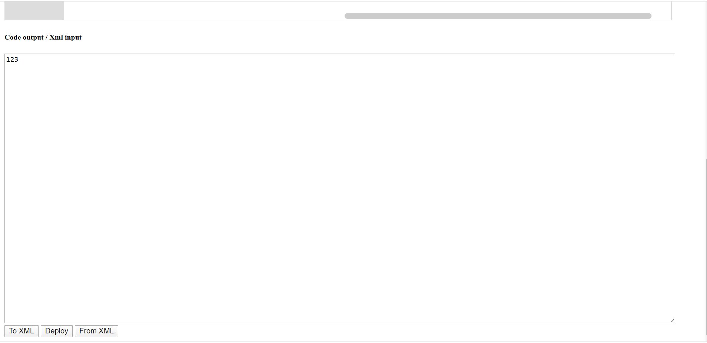
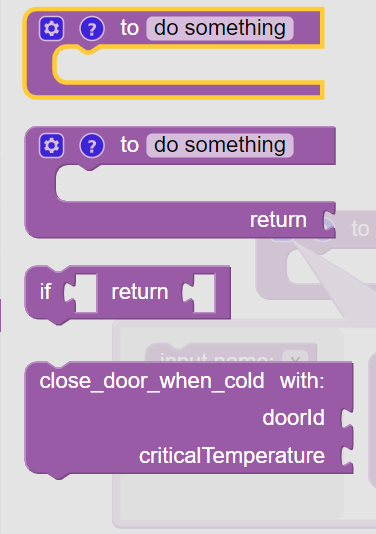
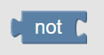
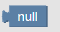

# Руководство пользователя конструктором сценарий <!-- omit in toc -->

## Содержание <!-- omit in toc -->

- [Описание интерфейса](#%d0%9e%d0%bf%d0%b8%d1%81%d0%b0%d0%bd%d0%b8%d0%b5-%d0%b8%d0%bd%d1%82%d0%b5%d1%80%d1%84%d0%b5%d0%b9%d1%81%d0%b0)
- [Составление сценария](#%d0%a1%d0%be%d1%81%d1%82%d0%b0%d0%b2%d0%bb%d0%b5%d0%bd%d0%b8%d0%b5-%d1%81%d1%86%d0%b5%d0%bd%d0%b0%d1%80%d0%b8%d1%8f)
  - [Основы](#%d0%9e%d1%81%d0%bd%d0%be%d0%b2%d1%8b)
  - [Переменные](#%d0%9f%d0%b5%d1%80%d0%b5%d0%bc%d0%b5%d0%bd%d0%bd%d1%8b%d0%b5)
  - [Функции](#%d0%a4%d1%83%d0%bd%d0%ba%d1%86%d0%b8%d0%b8)
  - [Экспорт](#%d0%ad%d0%ba%d1%81%d0%bf%d0%be%d1%80%d1%82)
  - [Импорт](#%d0%98%d0%bc%d0%bf%d0%be%d1%80%d1%82)
  - [Развёртывание](#%d0%a0%d0%b0%d0%b7%d0%b2%d1%91%d1%80%d1%82%d1%8b%d0%b2%d0%b0%d0%bd%d0%b8%d0%b5)
- [Описание блоков](#%d0%9e%d0%bf%d0%b8%d1%81%d0%b0%d0%bd%d0%b8%d0%b5-%d0%b1%d0%bb%d0%be%d0%ba%d0%be%d0%b2)
  - [Logic](#logic)
    - [If](#if)
    - [Boolean](#boolean)
  - [Loops](#loops)
  - [Math](#math)
  - [List](#list)
  - [Text](#text)
  - [IO](#io)

## Описание интерфейса

*Основное окно программы*

Слева расположено меню выбора блоков сценария. Доступные блоки подразделяются на категории: Logic, Math, Lists, Text, IO и специальные блоки Variables и Functions. Подробное описание блоков расположено [ниже](#%d0%9e%d0%bf%d0%b8%d1%81%d0%b0%d0%bd%d0%b8%d0%b5-%d0%b1%d0%bb%d0%be%d0%ba%d0%be%d0%b2).
При нажатии на категорию становятся доступны блоки из данной категории.

*Блоки категории "Math"*

Данные блоки могут быть помещены в сценарий путём их перетаскивания на рабочую область. Для удаления блока из рабочей области перетащите его в корзину в левом-нижнем углу.

Под основным полем расположено текстовое поле, выполняющее функцию отображения превью генерирующегося кода на языке Python, а также для [экспорта](#%d0%ad%d0%ba%d1%81%d0%bf%d0%be%d1%80%d1%82) и [импорта](#%d0%98%d0%bc%d0%bf%d0%be%d1%80%d1%82) сценария в формате XML. Под данным текстовым полем расположены кнопки [экспорта](#%d0%ad%d0%ba%d1%81%d0%bf%d0%be%d1%80%d1%82) - "To XML", [импорта](#%d0%98%d0%bc%d0%bf%d0%be%d1%80%d1%82) - "From XML", и [развёртывания](#%d0%a0%d0%b0%d0%b7%d0%b2%d1%91%d1%80%d1%82%d1%8b%d0%b2%d0%b0%d0%bd%d0%b8%d0%b5) - "Deploy"

## Составление сценария

### Основы

Все блоки, подобно пазлам, могут быть присоеденены друг к другу. Для этого просто перетаскивайте блоки так, чтобы их соединения совпали. 

*Примеры блоков*

Каждый блок может обладать несколькими из 4-х видов соединения:
1. Левое соединение. Данный тип соединения означает, что данный блок может быть использован в качестве значения другим блоком с правым соединением. Например, блок: константное число сам по себе представляет из себя числовое значение, в то время, как блок длины строки "length of" предоставляет результат оценки длины строки.
2. Правое соединение. Данный тип соединения означает, что данный блок требует на вход некоторое значение, т.е. необходимо присоединить блок с левым соединением. Например блоки "length of" и "print" ожидают строку.
3. Верхнее соединение. Данный тип соединения означает, что данный блок является командой и его можно соединить с нижним соединением: в этом случае устанавливается порядок исполнения: сначала верхний блок, затем нижний. Например блок "print" явно является командой.
4. Нижнее соединение. Данный тип соединения означает, что после данного блока возможно исполнение команд. Каждая команда имеет данное соединение, однако данное соединение есть также и у специальных блоков: определений [функции](#%d0%a4%d1%83%d0%bd%d0%ba%d1%86%d0%b8%d0%b8).

**Важные правила составления сценария:**
- Лучше не оставлять блоки "летающими в воздухе". Блоки-значения имеют значение только присоединёнными к команде. Соединённые блоки-команды лучше показывают порядок исполнения сценария.
- Если остались правые соединения без значений, то скорее всего была допущена ошибка и требуется добавить соответствующий блок-значение.  

### Переменные
Если открыть закладку "Variables" будет доступны блоки для работы с переменными.

Для создания новой переменной нажмите "Create variable...", введите название переменной в всплывающем окне и нажмите OK.

Переменные используются при помощи трёх блоков:
1. set *переменная* to *значение* - операция присваивания
2. change *переменная* by *значение* - операция инкремент
3. *переменная* - использование значения переменной

### Функции

Для возможности переиспользования сценариев можно создавать функции. На вкладке Functions доступны 4 вида блоков:
1. объявление функции без возврата значения
2. объявление функции с возвратом значения
3. условный возврат значения
4. блоки вывоза функций.

Для определения функции перетащите блок объявления функции на рабочее поле. В поле "to" указывается название функции. При нажатии на шестерёнку открывается меню, в котором блоками указываются входные параметры функции.

Внутрь данного блока помещаются блоки-команды для данной функции. Входные параметры доступны на вкладке "Variables".

Полученные функции можно вызывать при помощи соответствующего блока.

Блоки объявления функций не являются командами, поэтому не могут быть присоеденены к основным командам сценария. Тем не менее, рекомендуется помещать все объявления функций выше команд основного сценария и не на большом расстоянии друг от друга.

### Экспорт

Полученные сценарии можно сохранять в формате XML для дальнейшего переиспользования. В частности, имеет смысл создать некоторый набор стандартных функций-сценариев и загружать его при необходимости.

Чтобы получить XML текущего сценария нажмите кнопку "To XML". В текстовом поле появится XML сценария, который может быть сохранён при помощи любого текстового редактора.

### Импорт

Для импорта сценария вставьте XML сценария в текстовое поле и нажмите "From XML". На рабочем поле должны появиться блоки сценария, а в текстовом поле - превью кода на Python. 

### Развёртывание

Для развёртывания сценария нажмите кнопку "Deploy". В появившемся всплывающем окне введите название сценария, и нажмите ОК. Ещё раз проверьте правильность сценария и подтвердите отправку сценария на исполнение. 

## Описание блоков

### Logic

Данная категория имеет 2 подкатегории: If и Boolean

#### If

| Блок | Левое соединение | Правое соединение | Верхнее/нижнее соединение | Описание |
|------|------------------|-------------------|---------------------------|----------|
||Нет|Булево значение|Да|Условный оператор          |

#### Boolean

| Блок | Левое соединение | Правое соединение | Верхнее/нижнее соединение | Описание |
|------|------------------|-------------------|---------------------------|----------|
||Булево значение|Два значения|Нет|Оператор сравнения. Можно выбрать операции: равно, не равно, больше, не больше, меньше, не меньше|
||Булево значение|Два булевых значения|Нет|Булевы операции. Можно выбрать: AND, OR|
||Булево значение|Булево значение|Нет|Операция "НЕ". Инвертирует булево значение|
||Булево значение| Нет | Нет | Булева константа. Можно выбрать true, false|
||Значение null|Нет|Нет|Константа null|
||Булево значение|Test - булево значение, остальные - любые значения| Нет| Тернарный оператор сравнения. Если значение "test" - правдиво возвращает значение из "if true", иначе возвращает значение из "if false"|

### Loops

| Блок | Левое соединение | Правое соединение | Верхнее/нижнее соединение | Описание |
|------|------------------|-------------------|---------------------------|----------|
||Нет|Целое число|Верхнее и нижнее + нижнее для тела цикла|Выполнить тело цикла N раз
||Нет|Булево значение|Верхнее и нижнее + нижнее для тела цикла|Выполнить тело цикла в зависимости от условия. Можно выбрать: while - исполнять пока выполняется условие, until - исполнять до тех пор, пока не выполнится условие
||Нет|3 числа|Верхнее и нижнее + нижнее для тела цикла|Выполнить тело цикла, изменяя значение переменной i от значения "from" до "to" по "by". По-умолчанию заводится переменная i, можно выбирать любую другую переменную
||Нет|Список|Верхнее и нижнее + нижнее для тела цикла|Выполнить тело цикла, изменяя значение переменной j от первого до последнего элемента списка. По-умолчанию заводится переменная о, можно выбирать любую другую переменную
||Нет|Нет|Только верхнее|Выйти из цикла (если выбрано "break"), или перейти к следующей итерации цикла (если выбрано "continue"). Данный блок должен находиться внутри цикла

### Math

| Блок | Левое соединение | Правое соединение | Верхнее/нижнее соединение | Описание |
|------|------------------|-------------------|---------------------------|----------|
||Число|Нет|Нет|Числовая константа|
||Число|Два числа|Нет|Арифметическая операция. Можно выбрать "+","-",...|
||Число|Число|Нет|Унарная функция. Можно выбрать: "square root" - квадратный корень, "absolute" - модуль числа, "-" - унарный минус, "ln" - натуральный логарифм и другие
||Число|Число|Нет|Тригонометрическая функция. Можно выбрать синус, косинус, тангенс, и им обратные.
||Число|Нет|Нет|Математическая константа. Можно выбрать пи, е, золотое сечение, корень из 2, корень из одной второй или бесконечность
||Булево значение|Число|Нет|Проверка числа. Можно проверять на чётность/нечётность, простоту, целость, знак и на делимость. Если выбрана проверка на делимость, то появляется ещё одно правое соединение для числа, на которое должно делиться данное
||Число|Лист чисел|Нет|Агрегация листа чисел. Можно вернуть сумму, минимум, максимум, и другие
||Булево значение|3 числа|Нет |Исправляет число, если оно больше high или меньше low на high и low соответственно
||Число|2 числа|Нет| Случайное целое число в промежутке от "from" до "to"|
||Число|Нет|Нет|Случайное вещественное число от 0 (включительно) до 1 (не включительно)

### List
| Блок | Левое соединение | Правое соединение | Верхнее/нижнее соединение | Описание |
|------|------------------|-------------------|---------------------------|----------|
||Лист|Нет|Нет|Создаёт список без элементов
||Лист|N значений|Нет|Создаёт список из элементов. Нажмите на шестерёнку для задания количества элементов
||Лист|Два значения, первое - любое, второе - целое|Нет|Создаёт список повторяя элемент N раз
||Число|Лист|Нет|Возвращает длину листа
||Булево значение|Лист|Нет|Возвращает пуст ли лист
||Булево значение|Лист|Нет|Возвращает пуст ли лист
||Число|Лист и любое значение|Нет|Возвращает первый или последний индекс данного элемента в листе
||Значение|Лист и число|Нет|Возвращает элемент листа на выбор: N-ый, N-ый с конца, первый, последний, случайный
||Нет|Лист, число и любое значение|Да|Устанавливает на выбор N-ый, N-ый с конца, первый, последний, случайный элемент листа равным данному

### Text
| Блок | Левое соединение | Правое соединение | Верхнее/нижнее соединение | Описание |
|------|------------------|-------------------|---------------------------|----------|
||Строка|Нет|Нет|Строковая константа
||Число|Строка|Нет|Возвращает длину строки
||Нет|Строка|Да|Вывод строки. Используется только для отладки сценариев

### IO
| Блок | Левое соединение | Правое соединение | Верхнее/нижнее соединение | Описание |
|------|------------------|-------------------|---------------------------|----------|
||Значение|2 строки|Нет|Возвращает значение измерения "measurement" из таблицы "table"
||Нет|2 строки|Да|Отправляет в топик "query" JSON-строку

